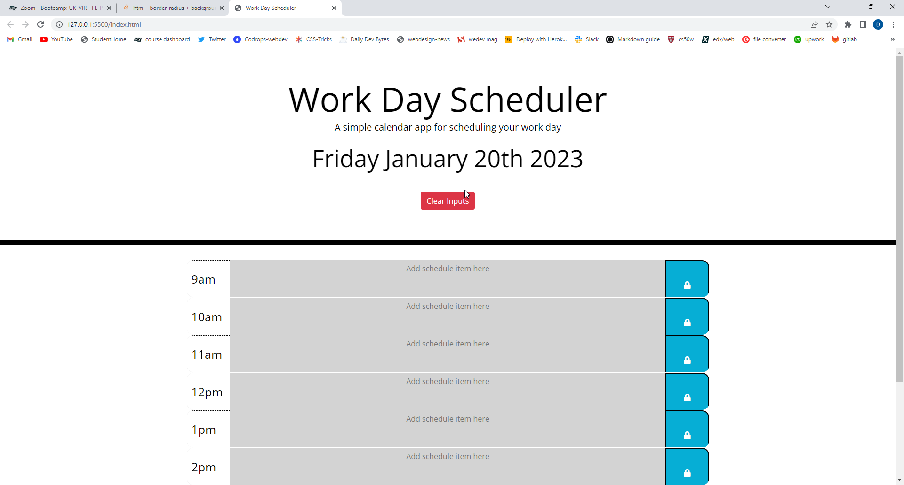

# PlannerApp

## User Story

```
AS AN employee with a busy schedule
I WANT to add important events to a daily planner
SO THAT I can manage my time effectively
```

---

## Discription

When opening this page you are welcomed with todays day and date and a clear inputs button.
Then lower down the page there are time slots from 9-5. next to these these time slots you have a text box to enter your taks and meetings for the day and a save button for each row and stores it to localStorage so each time you visit back to the page your taks are stil visible. until you click clear inputs button allowing you to enter your new tasks for the day.



---

## Tech

-   HTML
-   CSS
-   JavaScript
-   jQuery
-   Moment.js
-   bootstrap
